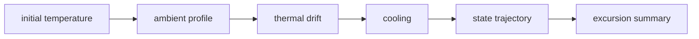

# Architecture

## State
Temperature and elapsed time form the simulated cold-chain state.

## Dynamics
Ambient temperature pulls the package toward environmental temperature while active cooling offsets drift.

## Simulation
Repeated time steps produce a trajectory.

## Excursion analysis
Time above a chosen threshold and maximum temperature summarize risk.

## Principle
Keep the physical assumptions visible and simple enough to challenge before adding ML or IoT complexity.
